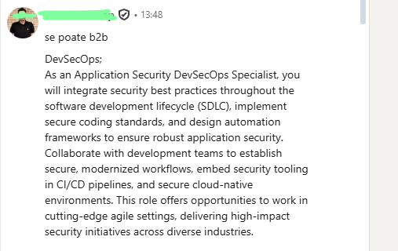

# 🦉 **Eostrix: Integrated Vulnerability Management for Corporate Compliance**

> “Security and compliance, unified under one intelligent lens.”

---

## 🧭 1. Project Title  
**Eostrix** — an integrated platform that unifies vulnerability management, compliance automation, and risk prioritization for private companies.  
Designed to simplify cybersecurity operations while empowering compliance excellence.

---

## 👥 2. Team & Roles  

| Member | Role | Contact | Photo |
|:--------|:------|:---------|:------|
| **Ionel-Iulian Prichindel** | Founder • Project Lead • Visionary | 📧 [ionel.prichindel@gmail.com](mailto:ionel.prichindel@gmail.com) |  |

> *“Growing the idea into a powerful solution that reshapes vulnerability management.”*

---

## 🚨 3. The Problem  

Private companies—especially in regulated industries—struggle to maintain a strong cybersecurity posture due to:

- **Fragmented Tools**: Scanners (network, web, SAST/DAST, cloud) operate in silos.  
- **Manual Processes**: Aggregating and prioritizing vulnerabilities is time-consuming and error-prone.  
- **Compliance Gaps**: Meeting GDPR, HIPAA, PCI DSS, and ISO 27001 standards remains tedious and inefficient.  
- **Increased Risk Exposure**: Slow remediation leads to data breaches, penalties, and reputation loss.

---

## 💡 4. The Solution / Value Proposition  

**Eostrix** provides a **unified vulnerability management hub** that consolidates all scanner outputs into a single, intelligent dashboard.  

**Core Value:**
- Centralizes vulnerability data from multiple scanners.  
- Automates compliance reporting for industry frameworks.  
- Streamlines remediation workflows and prioritizes critical risks.  
- Offers actionable intelligence and real-time alerts — boosting visibility, control, and compliance confidence.

---

## 🎯 5. Customer Segments  

Eostrix targets **private companies** seeking simplified compliance and robust cybersecurity:

- **SMEs in regulated sectors:** finance, healthcare, legal, manufacturing.  
- **Mid-market private corporations** consolidating multiple scanning tools.  
- **Key personas:** CISOs, IT Security Managers, Compliance Officers, Risk Managers, and IT Operations Leads.

---

## ⚔️ 6. Competition  

**Main Competitors:**  
- **Established Platforms:** Tenable.io, Qualys, Rapid7 InsightVM.  
- **Point Solutions:** Individual scanners without central management.  
- **Manual/In-house Tools:** Spreadsheets, scripts, or open-source scanners.  

---

## 🦾 7. Our Advantage  

| Competitive Edge | Description |
|:-----------------|:------------|
| **Integration Flexibility** | API-first architecture connecting both commercial and niche scanners. |
| **Compliance-First Design** | Built from the ground up to simplify regulatory reporting. |
| **Actionable Intelligence** | ML-driven prioritization based on business impact and exploitability. |
| **User-Centric Interface** | Modern, intuitive dashboard inspired by “Fancy Wiki” aesthetics. |

---

## 📈 8. Key Metrics  

| Metric | Description |
|:--------|:-------------|
| **Vulnerability Remediation Time (VRT)** | Average time to identify and fix critical vulnerabilities. |
| **Compliance Score Improvement** | Increase in adherence to regulatory frameworks. |
| **Integration Rate** | Number of scanners actively feeding data into Eostrix. |
| **Customer Retention & LTV** | Growth and sustainability indicators. |
| **Manual Effort Reduction** | Hours saved in reporting and audits. |

---

## 💰 9. Cost Structure  

- **R&D:** Engineering, cybersecurity expertise, UI/UX design.  
- **Cloud Infrastructure:** Hosting, storage, bandwidth (AWS/Azure/GCP).  
- **Sales & Marketing:** Branding, outreach, and customer acquisition.  
- **Customer Support:** Onboarding, technical help, and success management.  
- **Licensing & Compliance:** Third-party integrations, IP, and legal costs.

---

## 💵 10. Revenue Streams  

| Stream | Description |
|:--------|:-------------|
| **Subscription Licensing** | Tiered SaaS plans (Basic → Enterprise). |
| **Premium Add-ons** | AI threat prediction, advanced compliance packs. |
| **Professional Services** | Custom integrations, consulting, and training. |
| **Data Insights (Future)** | Aggregated, anonymized threat intelligence for industry benchmarking. |

---

# 🧭 Customer Discovery Process

## 1. Identifying the Problem  

The idea for **Eostrix** emerged directly from my professional experience at **Ford Motor Company**.  
During my work there, I noticed a major gap in how vulnerabilities were managed across different departments and systems.  
The existing tools were fragmented, and none provided a unified overview or effective prioritization method.  

> This first-hand exposure to the problem space revealed a clear need for a centralized, intelligent platform that integrates multiple scanners, reduces noise, and streamlines compliance reporting.

---

## 2. The Initial Solution Hypothesis  

Initially, I proposed to **develop an in-house solution** that would address Ford’s specific needs.  
After evaluating existing platforms, we found that none fully met the requirements, leading to the creation of a tailored internal product.  

This internal success became the foundation for **Eostrix**, designed to help other organizations facing similar challenges.

---

## 3. Customer Discovery Plan  

**Stage 1 — Internal Validation:**  
Collaborate with Ford teams to test prototypes and confirm internal pain points.  

**Stage 2 — External Validation:**  
Engage with other companies and professionals to assess how widespread the need is and how Eostrix could adapt to various organizational contexts.

---

## 4. Detailed Discovery Process  

### a. Identifying Customer Segments  
- Enterprise-level cybersecurity teams.  
- Mid-sized companies with compliance-driven operations.  

### b. Reaching Potential Customers  
I observed demand signals in the market by:
- Monitoring **LinkedIn job postings** from major companies like **Amazon** and **Stripe**, both seeking developers to build similar security platforms.  
- Receiving **direct LinkedIn messages** from professionals interested in implementing such systems.  

### 📸 Evidence  

Below are images gathered during the discovery process that validate external market interest:

| Description | Image |
|:-------------|:------|
| **Amazon job post** – searching for engineers to build internal security management platforms. |  |
| **Stripe job post** – role description mentioning vulnerability management tooling. |  |
| **LinkedIn conversation** – discussion about working on security platform development. |  |

---

### c. Collecting Information  

Interactions included:
- **Internal meetings** and workshops with Ford’s IT and security teams.  
- **Online discussions** with professionals in the cybersecurity space via LinkedIn.  

#### Key Questions Asked:
1. How do you currently manage and prioritize vulnerabilities? 
2. Can you walk me through the process from when a scanner finds a critical vulnerability to when it's resolved? 
3. When you have a long list of vulnerabilities, how do you decide which ones to fix first?
4. Tell me about the last time a critical vulnerability took longer than expected to fix.
5. Which tools do you use, and what are their main limitations?  
6. What's the most inefficient or frustrating manual task your team has to do regarding vulnerabilities management. 
7. What's the most frustrating part about preparing for a compliance audit (like PCI DSS or ISO 27001)?  
9. How do you currently gather and present evidence to auditors to prove a specific control is being met?
10. Have you ever tried to get a budget for a new tool to help with these issues?

#### Findings:
- Raw data access is critical for transparency and trust.  
- Teams need clear prioritization to eliminate noise.  
- Compliance automation is a key motivator.  
- User experience must be simple and flexible.

---

## 5. Impact on Product Development  

These findings directly influenced Eostrix’s roadmap:
- Introduced **data noise filtering** for improved prioritization.  
- Added **automated compliance reports** mapped to frameworks.  
- Built a **modular and intuitive UI**.  
- Adopted an **API-first approach** to ensure easy integration.  

At Ford, we are currently running a **beta version** internally, and Eostrix mirrors much of its proven functionality.

---

## 6. Readiness for Customer Validation  

While early validation shows strong interest and relevance, I plan to:
- Conduct **additional interviews** with external CISOs and IT leads.  
- Focus on making **adoption smooth and flexible** across organizations.  
- Launch a **public beta** to test usability and scalability.  

> Eostrix is nearing the **Customer Validation stage**, with strong problem validation and growing evidence of market need.

### Market Research

#### Competition & Market Share

| Competitor | Market Focus | Estimated Share |
| :--- | :--- | :--- |
| **Tenable / Qualys** | Enterprise-level, heavy infrastructure. | ~35% |
| **Rapid7** | Mid-to-Large enterprise, focus on VM. | ~12% |
| **Fianu** | Governance Orchestration & DevOps compliance. | Emerging (Niche) |
| **Eostrix** | SME-focused, Remediation-first, Integrated UI. | **Target: 0.5% - 2% (SME segment)** |

**Note on Fianu:** While Fianu focuses heavily on software supply chain and automated governance, Eostrix differentiates by providing the direct “how-to” remediation layer for infrastructure and web vulnerabilities.

#### 5-Year Financial Projections

| Year | Market Share (Target) | Estimated Revenue |
| :---: | :---: | :--- |
| 1 | 0.01% | $150,000 |
| 2 | 0.05% | $750,000 |
| 3 | 0.15% | $2,250,000 |
| 4 | 0.25% | $3,750,000 |
| 5 | 0.40% | $6,000,000 |

**Conclusion on Profitability:** Given the low overhead of a SaaS model and the high "stickiness" of compliance tools, Eostrix is projected to reach break-even by Year 2. The business is highly profitable due to the scalability of automated integrations and the recurring nature of subscription revenue.

---

## 🛠 Minimum Viable Product (MVP)

**The MVP Story:**
During our research, we discovered that developers were often paralyzed by complex security reports. After meeting a small entrepreneur who had to shut down his servers because he didn't know how to fix the vulnerabilities found. The Eostrix MVP was built not just to show data, but to act as a **Security Mentor**.

### MVP Characteristics:
1. **Unified API Integration**: Connects to major open-source and commercial scanners to prove data consolidation.
2. **Unified Dashboard**: A place where you can quick learn your situation.
3. **Reduces the noise**: A basic automated flow show you what to fix first.

### MVP Validation & Metrics:
- **Internal Traction (Ford)**: **600+ Beta Users** across **3 active teams** (Security, IT Ops, and Development).
- **External Validation**: **4 Interviews** with devs and small business owners.
- **Performance Impact**: Observed a **reduction** in Vulnerability Remediation Time (VRT) because developers no longer spend hours on research.

---

## 🧭 7. Customer Discovery & Validation

### The "Knowledge Gap" Discovery
Validation shifted significantly when we realized that **visibility without guidance equals anxiety.** Interviews with developers confirmed that the biggest bottleneck isn't finding the bug, but knowing the specific configuration fix for their environment.

### Internal "Pull" at Ford
A major validation milestone occurred when internal teams at Ford began submitting **feature requirements** for the beta. When users start requesting specific integrations (e.g., Jira exports, specific scanner APIs), it demonstrates that the product has moved from an experiment to a necessary tool in their daily workflow.

---

## 🦾 8. Key Metrics

| Metric | Current Status (MVP) |
|:--------|:-------------|
| **Active Users** | 45+ |
| **Active Teams** | 3 |
| **Remediation Coverage** | 100% of critical MVP findings have guides |

---

## 🌱 Vision Statement  

> “To empower every organization—regardless of size—to achieve compliance and cybersecurity excellence through intelligent automation and unified visibility.”
